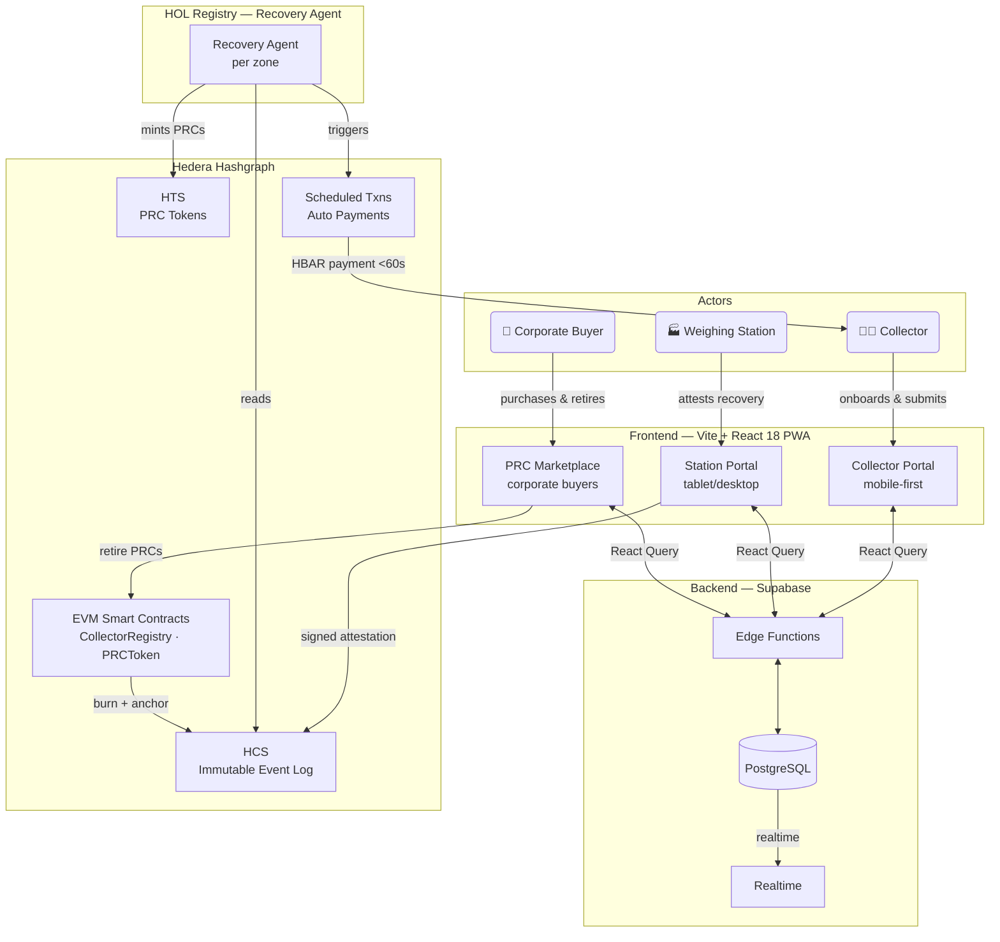
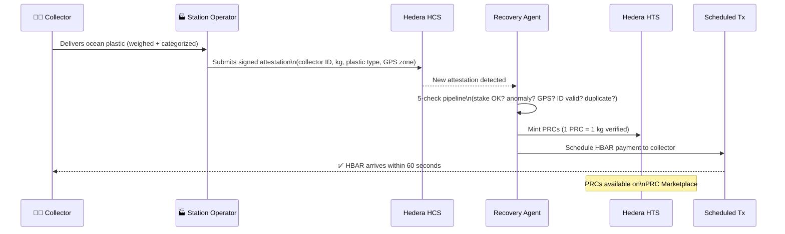

# PlastiCatch

**Paying Collectors to Clean the Ocean**

A plastic recovery marketplace that turns ocean waste into verifiable income for coastal communities --- powered by Hedera Hashgraph.

| | |
|---|---|
| **Track** | Sustainability |
| **Bounty** | Hashgraph Online ($8,000) |

---

## Problem

Over 14 million tons of plastic enter the ocean every year, yet the people best positioned to remove it --- fishermen, coastal residents, small boat operators --- have zero economic incentive to act. Existing cleanup efforts rely on volunteer labor or opaque corporate programs with no verifiable proof of impact. There is no credible, fraud-resistant measurement system for ocean plastic recovery; everything runs on self-reported tonnage figures and press releases.

## Solution

PlastiCatch creates a direct economic incentive for ocean plastic removal. Collectors bring recovered plastic to registered Weighing Stations, where it is weighed, categorized, and verified through a multi-factor attestation system. Verified recoveries trigger automatic HBAR payments to collectors within minutes via Hedera Scheduled Transactions --- no bank account required. Corporations purchase Plastic Recovery Credits (PRCs), HTS tokens each representing one verified kilogram removed, to back sustainability claims with tamper-proof, on-chain provenance.

---

## Key Features

- **Collector Onboarding** --- Phone-based identity with anti-Sybil protections (phone uniqueness + GPS zone tethering + DID anchor on HCS). No bank account or formal ID required.
- **Recovery Submission & Verification** --- Station operators weigh and categorize plastic, submit signed attestations to HCS. Recovery Agent runs a 5-check verification pipeline in real time.
- **Automatic Payments** --- Hedera Scheduled Transactions pay collectors in HBAR within 60 seconds of verified recovery. Dynamic payout rates based on plastic type, collector reputation, and demand.
- **PRC Marketplace** --- Corporations browse and purchase Plastic Recovery Credits filtered by zone, plastic type, and date. Full chain-of-custody provenance on every token.
- **PRC Retirement** --- Corporations retire (burn) PRCs on-chain with company name and report reference. Retirement events permanently anchored to HCS.
- **Station Staking** --- Weighing Stations stake 500 HBAR as a fraud bond, slashed on confirmed fraud. Makes the expected value of cheating negative.
- **Recovery Agent (HOL Registry)** --- Autonomous agent per geographic zone that verifies attestations, mints PRCs, triggers payments, detects anomalies, and answers natural-language queries via HCS-10.
- **Cleanup Events** --- Organizers register events, corporate sponsors deposit HBAR into a pool, and collectors earn multiplied payout rates during the event window.

---

## System Architecture



---

## Recovery Flow



---

## Tech Stack

| Layer | Technology |
|---|---|
| Frontend | Vite + React 18 + TypeScript + Tailwind CSS (PWA, mobile-first) |
| UI Components | shadcn/ui (Radix UI primitives) + Framer Motion |
| State & Data | TanStack React Query + React Hook Form + Zod |
| Backend | Supabase (PostgreSQL, Realtime, Edge Functions, Storage) |
| Blockchain | Hedera Hashgraph (`@hashgraph/sdk` v2.49) |
| Smart Contracts | Solidity on Hedera EVM (Hardhat + ethers.js) |
| Agent Layer | HOL Registry --- Recovery Agent per zone |
| Testing | Vitest + Testing Library + Playwright |

## Hedera Services Used

| Service | Usage |
|---|---|
| **HCS (Consensus Service)** | Immutable event log for collector registrations, station registrations, recovery attestations, PRC minting events, PRC retirements, cleanup events, DID anchoring, demand signals, and impact reports |
| **HCS-10** | Bidirectional messaging between Recovery Agent and corporate buyers for natural-language queries with on-chain proof of responses |
| **HTS (Token Service)** | Fungible PRC tokens (1 PRC = 1 verified kg removed). One token type per zone. 3-decimal granularity. Station staking tokens |
| **Scheduled Transactions** | Automatic HBAR payments from payment pool to collector wallets within 60 seconds of attestation verification |
| **Smart Contracts (EVM)** | `CollectorRegistry.sol`, `StationRegistry.sol`, `PRCToken.sol`, `CorporateVault.sol`, `CleanupEventPool.sol`, `ReputationOracle.sol` |
| **Mirror Node** | Historical event queries, attestation lookups, provenance chain retrieval |
| **Account Creation** | Sponsored Hedera account creation for collectors at onboarding (funded with 0.3 HBAR credit) |

---

## Project Structure

```
plasticatch-main/
  contracts/             # Solidity smart contracts (Hardhat)
    src/                 #   CollectorRegistry, StationRegistry, PRCToken, CorporateVault, CleanupEventPool, ReputationOracle
    scripts/             #   Deployment scripts
  scripts/               # Setup & operations scripts
    init-hedera.js       #   Create Hedera topics, tokens, accounts
    seed-test-data.js    #   Populate test data
    start-agents.js      #   Launch Recovery Agents
    fund-payment-pool.js #   Fund the collector payment pool
  src/
    pages/               # Route pages
      Landing.tsx        #   Public landing page
      OnboardingSelect.tsx #  Role-selection gateway (/onboarding)
      CollectorOnboarding.tsx
      CollectorDashboard.tsx
      StationOnboarding.tsx
      StationDashboard.tsx
      RecoverySubmission.tsx
      PrcPurchase.tsx     #   PRC marketplace for corporate buyers
      Leaderboard.tsx
      ImpactAgent.tsx     #   HCS-10 on-chain impact query interface
    components/          # Shared UI components (shadcn/ui)
      DashboardLayout.tsx #  Compact sticky header for authenticated pages
      Navbar.tsx         #   Public navbar (Leaderboard · Impact Agent · Buy Credits)
      RoleGuard.tsx      #   Auth guard redirecting to onboarding
    contexts/
      AuthContext.tsx    #   Session state (collector / station localStorage)
    lib/
      hedera/
        hashconnect.ts   #   HashConnect singleton for station wallet pairing
        hcs10.ts         #   HCS-10 envelope types and HashScan URL helpers
      contracts.ts       #   Smart contract addresses
      constants.ts       #   Geographic zones and shared constants
    hooks/               # Custom React Query hooks
    test/                # Unit and integration tests
  supabase/
    migrations/          # Database migrations
    functions/           # Supabase Edge Functions
  public/                # Static assets
```

---

## Quick Start

### Prerequisites

- Node.js 18+ (or Bun)
- A Hedera testnet account with testnet HBAR ([portal.hedera.com](https://portal.hedera.com))
- A Supabase project ([supabase.com](https://supabase.com))

### Install

```bash
# Clone the repository
git clone <repo-url>
cd plasticatch-main

# Install dependencies
npm install

# Install contract dependencies
cd contracts && npm install && cd ..
```

### Environment

```bash
# Copy the example env file
cp .env.example .env

# Fill in your Supabase and Hedera credentials
# See DEPLOYMENT.md for full env var reference
```

### Hedera & Contract Setup

```bash
# Initialize Hedera topics, tokens, and accounts
npm run init:hedera

# Deploy smart contracts to Hedera testnet
npm run deploy:contracts

# Fund the collector payment pool
npm run fund:pool

# Seed test data (optional)
npm run seed:data

# Or run all setup steps at once
npm run setup:all
```

### Run

```bash
npm run dev
```

The app will be available at `http://localhost:8082`.

> **Note:** Station onboarding requires a WalletConnect project ID for HashConnect pairing.
> Get a free project ID at https://cloud.walletconnect.com and add it to `.env`:
> `VITE_WALLETCONNECT_PROJECT_ID=<your-project-id>`

---

## Database Schema

The complete schema (all tables, policies, indexes, and RPCs in one file) is at [`supabase/schema.sql`](./supabase/schema.sql).

---

## Other Documentation

- [TESTING.md](./TESTING.md) --- Manual testing guide with step-by-step flows
- [DEPLOYMENT.md](./DEPLOYMENT.md) --- Full deployment and environment setup reference
- [PITCH_DECK.md](./PITCH_DECK.md) --- 10-slide pitch deck
- [plasticatch_architecture.md](./plasticatch_architecture.md) --- Full technical architecture document
