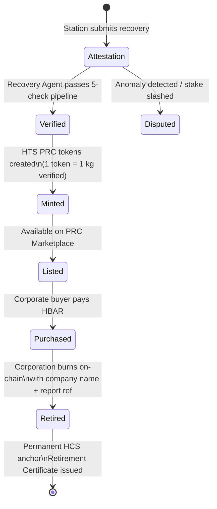
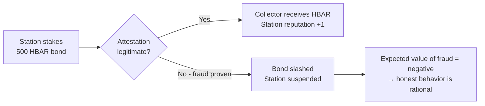

PLASTICATCH
Paying Collectors to Clean the Ocean
Full Technical Architecture — Production Developer Reference

Technology Stack
Blockchain: Hedera Hashgraph — HCS · HTS · Scheduled Transactions · EVM Smart Contracts
Agent Layer: HOL Registry — Recovery Agent per zone (autonomous minting + payments)
Identity: Phone-based Anti-Sybil + DID anchoring on HCS (no bank account required)
Frontend: Vite + React 18 · TypeScript · Tailwind CSS · shadcn/ui · PWA (collector mobile-first)
Backend: Supabase — PostgreSQL · Realtime · Edge Functions · Storage
Track: Sustainability  |  Bounty: Hashgraph Online ($8,000)

Version 1.0  |  March 2026
 
1. Product Vision & Core Problem
PlastiCatch is a plastic recovery marketplace that solves the ocean plastic crisis by attacking its actual root cause: not a lack of technology, not a lack of labor, but a missing economic incentive. The people best positioned to remove plastic from the ocean — fishermen, coastal communities, small boat operators — are already on the water. They already encounter plastic constantly. They throw it back not out of indifference but because keeping it has no value.

PlastiCatch creates that value. Collectors bring plastic to registered Weighing Stations, have their recovery verified by staked station operators, and receive HBAR payments automatically within minutes via Hedera Scheduled Transactions. Corporations purchase Plastic Recovery Credits (PRCs) — HTS tokens each representing one verified kilogram removed from the ocean — to back sustainability claims with tamper-proof, on-chain provenance. The fisherman gets paid. The ocean gets cleaned. The corporation gets verifiable impact. No intermediary takes 40%.

1.1 The Three Market Failures PlastiCatch Fixes
Failure	Current State	PlastiCatch Fix
No Collector Incentive	Removing ocean plastic earns zero. The best-positioned cleaners — people already on the water — have no reason to act.	Per-kilogram HBAR payments, automated, no bank account needed, within minutes of verified recovery.
No Corporate Proof	Corporations spend billions on sustainability marketing with no verifiable environmental impact. Press releases, not provenance.	Each PRC carries full chain-of-custody: collector ID, station ID, GPS zone, date, plastic type, weight. Retired on-chain with company name permanently.
No Measurement Infrastructure	Ocean plastic recovery has no credible, fraud-resistant measurement system. Everything relies on self-reported tonnage figures.	Three-factor verification per recovery: collector delivery + staked station attestation + Recovery Agent cross-check. Anti-Sybil identity for collectors.

2. Full System Architecture
2.1 Layer Map
Layer	Detail
Presentation Layer	Three portals: (1) Collector PWA — mobile-first, offline-capable, icon-based UI, multi-language. (2) Weighing Station Portal — tablet/desktop for station operators submitting attestations. (3) Corporate Buyer Portal — PRC marketplace, impact dashboards, retirement certificates.
API Layer	Next.js API Routes + Supabase Edge Functions. Recovery Agent communicates via HCS-10. All attestation submissions validated server-side before HCS anchoring.
Smart Contract Layer	Five Solidity contracts on Hedera EVM: CollectorRegistry.sol, StationRegistry.sol, PRCToken.sol, CorporateVault.sol, CleanupEventPool.sol.
Hedera Services	HCS: collector registrations, station registrations, recovery attestations, PRC minting events, retirements, cleanup events — all immutable. HCS-10: collector payment notifications, corporate impact query responses. HTS: PRC tokens, station staking. Scheduled Transactions: automatic collector HBAR payments.
Agent Layer	HOL Registry — one Recovery Agent per geographic zone. Stateless; reconstructs from HCS on restart. Monitors attestations, verifies station stake, mints PRCs, triggers payments, answers NL queries, generates weekly impact reports.
Identity Layer	Collector Anti-Sybil: phone-number uniqueness + GPS zone tethering. DID anchored to HCS at registration. No bank account, no formal ID required. Weighing Station: stake bond (500 HBAR minimum) + admin verification of physical existence.
Database Layer	Supabase PostgreSQL: all mutable state. Realtime for live dashboards. Edge Functions for Mirror Node sync and anomaly alerting.

2.2 Actor Ecosystem
Actor	Real-World Identity	Role
Collector	Fisherman, coastal resident, cleanup crew member, boat operator	Recovers ocean plastic, delivers to Weighing Station, earns HBAR
Weighing Station	Port authority, recycling depot, NGO collection point, municipal facility	Weighs and categorizes plastic, submits signed attestations, stakes HBAR bond
Recovery Agent	HOL Registry autonomous agent (one per zone)	Verifies attestations, mints PRCs, triggers payments, answers queries, generates reports
Corporate Buyer	Consumer goods company, logistics firm, event sponsor, municipality	Purchases PRCs, retires for sustainability claims, funds cleanup events
Event Organizer	Local NGO, municipal government, corporate CSR team	Registers cleanup events, attracts corporate sponsors, coordinates collectors
Validator	Senior platform participant or ecological institution	Resolves contested attestations where station and collector evidence conflicts

2.3 End-to-End Data Flow
RECOVERY FLOW:
  Collector delivers plastic → Station weighs + categorizes → Station submits HCS attestation (signed)
  → Recovery Agent verifies (stake check + anomaly check) → PRCs minted (HTS)
  → Scheduled Transaction: HBAR to collector wallet within 60 seconds
  → Collector PWA push notification: "Payment confirmed: X HBAR for Ykg"

CORPORATE FLOW:
  Buyer browses PRC marketplace → filters by zone, type, date → purchases PRCs (HBAR → PRC)
  → Retirement: burns PRCs on-chain with company name + report reference
  → Retirement Certificate NFT minted → public impact page updated

EVENT FLOW:
  Organizer registers event → Corporate sponsor deposits HBAR into CleanupEventPool
  → Collectors participate during event window → earn multiplied rate
  → Event closes → total impact anchored to HCS → sponsor receives event summary NFT

AGENT QUERY FLOW:
  Corporate buyer queries via HCS-10 → Agent queries HCS + Supabase → structured response
  → Response anchored to HCS → buyer sees on-chain proof of what they were told

2.4 PRC Lifecycle Diagram

2.5 Station Stake & Fraud Deterrence

3. Plastic Type Taxonomy & Payout Rates
Not all ocean plastic has equal recovery difficulty or commodity value. A taxonomy of plastic types anchors the payout structure to real-world recovery economics. Collectors know in advance what each type pays. Station operators select from a structured list — no free-text entries that could be gamed.

3.1 Plastic Type Taxonomy
Type ID	Description	Base Payout Rate
PET_BOTTLES	PET plastic bottles (water, beverage, consumer goods)	0.40 HBAR/kg — highest commodity value, most common, cleanest
HDPE_RIGID	HDPE rigid plastic (containers, crates, drums)	0.35 HBAR/kg — durable, high recycling value
FISHING_GEAR	Nets, lines, ropes, traps (ghost gear)	0.55 HBAR/kg — hardest to remove, highest ecological harm, premium rate
FILM_PLASTIC	Plastic bags, packaging film, wrapping	0.20 HBAR/kg — low commodity value, high volume, essential to remove
FOAM_EPS	Expanded polystyrene (foam cups, packaging)	0.15 HBAR/kg — breaks into microplastics, hazardous, low commodity value
MIXED_HARD	Mixed rigid plastic, unidentifiable type	0.25 HBAR/kg — default for unsorted rigid plastic
MIXED_SOFT	Mixed flexible/soft plastic, multilayer	0.15 HBAR/kg — lowest commodity value, difficult to recycle
MICROPLASTIC_BAG	Pre-sorted microplastics, collected in certified bags	0.60 HBAR/kg — special collection only, certified station required

3.2 Payout Rate Modifiers
finalPayout = baseRate[plasticType] × reputationMultiplier × demandBonus × eventMultiplier

reputationMultiplier: collector reputation tier (see §8)
  Tier 0 (Newcomer):    1.00×
  Tier 1 (Active):      1.10×
  Tier 2 (Established): 1.20×
  Tier 3 (Dedicated):   1.35×
  Tier 4 (Champion):    1.50×

demandBonus: set weekly by Recovery Agent based on corporate PRC demand
  Low demand:    1.00×  (no bonus)
  Medium demand: 1.10×
  High demand:   1.20×
  Surge demand:  1.30×  (agent triggers when PRC inventory < 1,000 units)

eventMultiplier: active during registered Cleanup Events
  Standard event:   1.25×
  Corporate-funded: 1.50×  (corporate sponsor covers the premium)

All rates stored as integers (tinybar per gram) — no floating point on-chain.
Example: 10kg FISHING_GEAR, Tier 2 collector, no bonus, no event:
  payout = 10,000g × 55 tinybar/g × 1.20 = 660,000 tinybar = 6.6 HBAR

4. Anti-Sybil & Collector Identity
Collector identity is the most critical security layer in PlastiCatch. Fraudulent registrations — fake collectors colluding with a station operator to submit fabricated recoveries and drain the payment pool — must be economically impossible, not just technically difficult. The identity system must simultaneously be zero-friction for genuine collectors (a fisherman with a smartphone, no bank account, no formal ID) and Sybil-resistant enough that mass wallet farming is not viable.

4.1 Three-Layer Identity Model
Layer	Mechanism	What It Prevents
Layer 1: Phone Uniqueness	One phone number = one collector wallet. OTP-verified at onboarding. SHA-256 hash of phone stored (not plaintext). Duplicate phone rejected at registration.	Eliminates mass wallet farming at near-zero friction for legitimate collectors.
Layer 2: GPS Zone Tethering	Collector registers a primary operating zone (coastal area, port district). GPS location recorded at each attestation submission. Submissions from zones > 200km from registered zone flagged for review.	Prevents remote actors registering as coastal collectors they cannot physically be.
Layer 3: DID Anchor	W3C DID document anchored to HCS at registration: { collectorId, phoneHash, walletAddress, zone, registeredAt }. Portable, verifiable, not tied to PlastiCatch platform.	Creates a persistent identity that survives platform changes. Used for reputation portability.

4.2 Collector Onboarding Flow
1.	Collector opens PlastiCatch PWA on any smartphone — no app store, installs from browser
2.	Selects preferred language: English, Arabic, Spanish, French, Portuguese, Hindi, Swahili (expandable)
3.	Enters phone number → OTP SMS delivered → verified. Phone hash computed client-side.
4.	Hash checked against collectors table — if duplicate: "This phone is already registered"
5.	Operating zone selected: large geographic zone from a dropdown (not precise GPS — avoids exposing exact home location). Examples: "North Mediterranean Coast," "Arabian Gulf — Kuwait to Oman," "Pacific — Philippines"
6.	Wallet created: Hedera account generated by PlastiCatch account creation service. Device biometric (Face ID / fingerprint) locks the key locally.
7.	DID document generated and anchored to HCS
8.	Collector receives 0.3 HBAR onboarding credit from Protocol Treasury (covers first ~20 transaction fees)
9.	PWA shows nearest registered Weighing Stations: distance, accepted plastic types, current payout rates, and any active demand bonuses

4.3 Station Stake as Fraud Bond
Weighing Stations must stake 500 HBAR (~$35) to register. This stake is slashed on confirmed fraud. The economic math: a fraudulent attestation of 10kg fishing gear earns approximately 6.6 HBAR for the collector. Break-even fraud requires roughly 75 successful fraudulent attestations before a single detection — which triggers the Recovery Agent's anomaly detection well before that threshold. The station's 500 HBAR bond makes the expected fraud value negative.

5. Weighing Station Onboarding & Operations
5.1 Station Registration
10.	Station operator submits application via portal: facility name, physical address, GPS coordinates, facility type (port authority / recycling depot / NGO point / municipal facility), accepted plastic types, operating hours
11.	Calibration certificate upload: scale calibration document hashed and stored. Must be renewed annually.
12.	Stakes 500 HBAR into StationRegistry.sol. Stake held until station deregisters.
13.	PlastiCatch admin reviews: verifies physical address exists, calibration cert is valid, facility type is appropriate. 24–48h SLA.
14.	Approval on-chain: StationRegistry.approveStation(stationId). Station becomes active.
15.	Station appears on Collector PWA map within 5 minutes of approval (Supabase Realtime).

5.2 Daily Attestation Workflow
16.	Collector arrives at station with sorted plastic
17.	Operator opens Station Portal → selects "New Recovery Submission"
18.	Collector identified: either scans wallet QR code from their PWA, or operator searches by Collector ID (displayed in app)
19.	Operator places plastic on calibrated scale per type. Enters weight in grams for each type.
20.	System computes expected payout in real time — operator confirms the amount with the collector before submission
21.	Optional: station operator photographs the plastic batch. Photo hashed client-side.
22.	Operator reviews summary and submits — signs with station wallet
23.	Recovery Attestation published to HCS. Recovery Agent processes within 30 seconds.
24.	Collector PWA push notification delivered via HCS-10: "Payment incoming — X HBAR for Ykg"

5.3 Attestation Schema
{
  "eventType": "RECOVERY_ATTESTATION",
  "attestationId": "uuid",
  "collectorId": "0.0.45678",
  "stationId": "0.0.11111",
  "zone": "MEDITERRANEAN_NORTH",
  "plasticItems": [
    { "type": "FISHING_GEAR", "weightGrams": 8200 },
    { "type": "PET_BOTTLES",  "weightGrams": 3100 }
  ],
  "totalWeightGrams": 11300,
  "photoHash": "sha256:abc...",
  "stationStakeStatus": "active",
  "stationNonce": 1042,
  "operatorSignature": "0x...",
  "submittedAt": 1700000000
}

5.4 Station Dashboard
Metric	Description
Daily Volume	Total kg submitted today by plastic type. Trend vs 7-day average.
Active Collectors	Unique collectors who have submitted through this station in the last 30 days.
Payout Total	Total HBAR distributed to collectors via this station this month.
Stake Status	Current 500 HBAR stake, at-risk status, calibration cert expiry countdown.
Anomaly Flags	Any submissions flagged by the Recovery Agent for review.
Revenue Share	If station charges a per-kg service fee: running monthly total.

6. Recovery Agent (HOL Registry)
One Recovery Agent is deployed per geographic zone — defined as a coastal region containing at least 3 active Weighing Stations. The agent is stateless between restarts; all durable state reconstructs from HCS + Supabase. It has one mission: for every valid attestation in its zone, mint PRCs and pay the collector.

6.1 Agent Responsibilities
Function	Detail
Attestation Verification	Receives every HCS attestation message from its zone. Runs 5-check pipeline (§6.3). Triggers minting and payment or opens dispute.
PRC Minting	Calls PRCToken.sol.mintRecovery() for each verified attestation. PRCs minted to a holding vault first, available for corporate purchase.
Payment Triggering	Creates Hedera Scheduled Transaction: HBAR from payment pool to collector wallet. Executes within 60 seconds of verification passing.
Demand Signal	Weekly: checks PRC inventory vs corporate buy rate. If inventory < 1,000 PRCs, publishes DEMAND_SIGNAL to HCS — activates demand bonus rate for that zone.
Impact Report Generation	Weekly: auto-generates zone impact report (total kg, collector count, PRC minted, corporate buyers served). Report anchored to HCS. Used in corporate dashboards.
NL Query Interface (HCS-10)	Receives natural language queries from corporate buyers and regulators. Interprets via Claude API. Retrieves data from HCS + Supabase. Responds via HCS-10. Query + response both anchored.
Anomaly Detection	Real-time: flags volume spikes, frequency anomalies, GPS inconsistencies. Pauses affected attestation pending investigation.
SLA Monitoring	Tracks collector payment latency. Alerts ops team if any payment pending > 5 minutes.

6.2 Attestation Verification Pipeline
async function verifyAttestation(msg: HCSMessage): Promise<VerificationResult> {

  // CHECK 1: Station active and staked
  const station = await getStation(msg.stationId);
  if (!station || station.stakeStatus !== "active")
    return REJECT("STATION_NOT_ACTIVE");

  // CHECK 2: Calibration cert not expired
  if (station.calibrationExpiry < Date.now())
    return REJECT("CALIBRATION_EXPIRED");

  // CHECK 3: Collector registered and active, not blacklisted
  const collector = await getCollector(msg.collectorId);
  if (!collector || collector.status !== "active")
    return REJECT("COLLECTOR_INVALID");

  // CHECK 4: Volume anomaly — > 3× 30-day rolling average for this collector-station pair
  const avg30d = await getAvgVolume(msg.collectorId, msg.stationId, 30);
  if (msg.totalWeightGrams > avg30d * 3.0 && avg30d > 0)
    return FLAG("VOLUME_ANOMALY");

  // CHECK 5: Frequency anomaly — same collector + same station, same calendar day
  const todayCount = await getTodaySubmissions(msg.collectorId, msg.stationId);
  if (todayCount >= MAX_DAILY_SUBMISSIONS)  // default: 3
    return FLAG("FREQUENCY_ANOMALY");

  // All checks pass
  return APPROVE();
}

6.3 NL Query Examples
// Via HCS-10 from corporate buyer:
"How much plastic has been collected in the Mediterranean this month?"
→ Agent queries Supabase: SUM(weightGrams) WHERE zone=MEDITERRANEAN AND month=current
→ Response: { kg: 48_210, collectors: 143, topType: "FISHING_GEAR", stations: 12 }
→ Response anchored to HCS. Buyer receives verifiable answer.

"Which station has the highest recovery volume this quarter?"
→ Agent aggregates by stationId, sorts DESC
→ Response: { station: "Alexandria Port Main", kg: 12_400, collectors_served: 67 }

"How many PRCs are currently available to purchase in my preferred zone?"
→ Agent queries PRCToken vault balance for zone
→ Response: { available_prcs: 3_821, by_type: { FISHING_GEAR: 1200, PET_BOTTLES: 2621 } }

"Show me the full provenance of PRC batch #4521"
→ Agent reads HCS minting event → attestation event → collector + station IDs
→ Response: full chain-of-custody JSON with HCS sequence numbers for independent verification

7. PRC Token — Full Specification
7.1 Token Design
Property	Detail
Token Standard	HTS Fungible Token. One token type per zone to maintain secondary market liquidity. Provenance tracked in Supabase + HCS, linked by minting event ID.
Denomination	1 PRC = 1 verified kilogram of ocean plastic removed. Fractional PRCs: token has 3 decimals — 0.001 PRC = 1 gram minimum granularity.
Provenance Metadata	Every PRC batch minted carries: attestationId, collectorId, stationId, zone, plasticType, weightGrams, payoutHBAR, hcsAttestationSequence, mintedAt. Stored in Supabase linked to mintingEventId.
Transferability	Freely transferable between wallets. Full provenance chain preserved on transfer.
Retirement	Corporate buyer calls PRCToken.retire(amount, companyName, reportRef). Tokens burned permanently. Retirement event anchored to HCS.
Vintaging	PRCs carry a harvest year. Buyers can filter by recency. Older unretired PRCs remain valid — there is no expiry. Ocean plastic removed in 2024 is still ocean plastic removed.

7.2 PRC Minting Flow
25.	Recovery Agent calls PRCToken.sol.mintRecovery(collectorId, stationId, plasticType, weightGrams, zoneId)
26.	Contract validates: stationId is active, collectorId is registered, weightGrams > 0
27.	PRCs minted to PRC Vault: held until corporate buyer purchases. Not pre-allocated to collector — collector receives HBAR, not PRCs.
28.	Minting event anchored to HCS: { attestationId, collectorId, stationId, prcsMinted, payoutTinybar, mintedAt }
29.	Scheduled Transaction created simultaneously: HBAR transferred from Payment Pool to collector wallet
30.	Supabase collector record updated: total_kg_recovered, total_hbar_earned, prc_contributions

7.3 Retirement Certificate NFT
When a corporate buyer retires PRCs, they receive a non-transferable Retirement Certificate as an HTS NFT.
{
  "certId": "PC-2025-CORP-0042",
  "company": "Acme Beverages Ltd",
  "reportRef": "Acme-ESG-2025-Q2",
  "plasticRetired": {
    "totalKg": 5000,
    "byType": {
      "PET_BOTTLES": 3200,
      "FISHING_GEAR": 1100,
      "FILM_PLASTIC": 700
    }
  },
  "provenance": [
    {
      "attestationId": "uuid",
      "collectorId": "0.0.45678",
      "stationId": "0.0.11111",
      "zone": "MEDITERRANEAN_NORTH",
      "weightGrams": 11300,
      "date": "2025-03-15",
      "hcsSequence": 44821
    },
    // ... all contributing attestations
  ],
  "collectorsSupported": 143,
  "hbarPaidToCollectors": 19420,
  "retiredAt": 1735689600,
  "retirementHcsSequence": 58021,
  "ipfsHash": "QmXyz..."
}

8. Collector Reputation System
The reputation system is both a quality enforcement mechanism and an incentive structure. It rewards the collectors who show up consistently, recover the most plastic, and work across multiple stations — the most valuable and reliable members of the network. Reputation is entirely on-chain: computed by the ReputationOracle contract from HCS activity, not assigned by PlastiCatch administrators.

8.1 Reputation Score Formula
function computeReputationScore(collectorId: string): number {
  const c = await getCollectorHistory(collectorId);

  // Volume score (40% weight): log scale — prevents pure-volume dominance
  const volumeScore = Math.log10(c.totalKgRecovered + 1) * 40;

  // Consistency score (30% weight): consecutive weeks active
  const consistencyScore = computeActiveWeekStreak(c.recoveries) * 2.5; // max 30

  // Station diversity (20% weight): unique stations used
  const diversityScore = Math.min(c.uniqueStationCount, 5) / 5 * 20;

  // Type variety bonus (10% weight): collects hard types (ghost gear, microplastics)
  const hardTypePct = c.kgByType["FISHING_GEAR"] + c.kgByType["MICROPLASTIC_BAG"];
  const typeScore = (hardTypePct / c.totalKgRecovered) * 10;

  return volumeScore + consistencyScore + diversityScore + typeScore;
}
// Score stored in ReputationOracle.sol on-chain. Mirrored to Supabase for fast reads.

8.2 Reputation Tiers & Payout Multipliers
Tier	Benefits	Requirements
Tier 0: Newcomer (0–50)	1.00× payout on all plastic types	No minimum — all new collectors start here
Tier 1: Active (51–200)	1.10× payout. Featured on zone leaderboard.	30+ days active, 100+ kg total recovered
Tier 2: Established (201–500)	1.20× payout. Priority assignment for corporate cleanup events.	90+ days active, 500+ kg
Tier 3: Dedicated (501–800)	1.35× payout. Vouching privileges (can vouch for new collectors).	180+ days, 2,000+ kg, 3+ unique stations
Tier 4: Champion (801+)	1.50× payout. Permanent public leaderboard legacy record. Protocol governance participation.	1 year+ active, 5,000+ kg, 5+ stations

8.3 Public Leaderboard
The public leaderboard is anchored to HCS — a permanent, immutable record of the most impactful collectors on the network. It is updated weekly by the Recovery Agent and published as a LEADERBOARD_UPDATE event. A fisherman who removes 10,000kg from the ocean has a verifiable on-chain legacy that cannot be erased or altered. Leaderboard displays: collector display name (can be pseudonymous), zone, total kg recovered, plastic type breakdown, HBAR earned lifetime, and weeks active.

9. Corporate Buyer Flow
9.1 Onboarding
31.	Company registers on Corporate Buyer Portal: company name, jurisdiction, industry sector, sustainability contact details
32.	KYC lite: email verification + company registration number (lightweight — corporate buyers are lower fraud risk than payment recipients)
33.	Wallet created or connected (MetaMask / HashPack for institutional buyers, custodial option for non-crypto-native companies)
34.	Buyer profile goes live. Access to PRC marketplace.

9.2 PRC Purchase Flow
35.	Buyer browses PRC marketplace: filter by zone, plastic type, vintage, and collector tier minimum (e.g. "only PRCs from Tier 2+ collectors")
36.	Buyer selects quantity and type. Provenance summary shown: how many collectors, which stations, date range.
37.	Purchase transaction: HBAR transferred from buyer wallet to CorporateVault.sol. PRCs transferred to buyer wallet.
38.	Purchase event anchored to HCS: { buyerCompany, prcsBought, hbarPaid, provenanceSummaryHash }

9.3 PRC Retirement Flow
39.	Buyer opens retirement tool: selects PRCs to retire, enters company name (as it should appear on public record), ESG report reference
40.	Calls PRCToken.retire(). Tokens burned permanently.
41.	Retirement event anchored to HCS with full provenance: every contributing attestation ID, collector ID, station ID, weight, date
42.	Retirement Certificate NFT minted to buyer wallet (non-transferable)
43.	Corporate impact page updated: cumulative kg retired, collector count supported, map of collection zones
44.	Company can embed a public impact widget on their own website: pulls live data from Mirror Node directly — no trust in PlastiCatch required

9.4 Corporate Impact Public Page
Every registered corporate buyer has a public impact page at plasticatch.io/impact/{companySlug}. The page is generated entirely from Mirror Node data — no PlastiCatch servers involved in the rendering. This means the page is independently verifiable and cannot be altered by PlastiCatch. Companies can link to this page from their sustainability reports knowing it cannot be retroactively modified.

10. Community Cleanup Events
Cleanup Events are structured, time-bounded recovery drives — coordinated by local organizers, funded by corporate sponsors, and delivered by the existing collector network. They are the community activation mechanism that turns individual collection into visible collective impact.

10.1 Event Registration Flow
45.	Organizer registers event: name, zone(s), date range (up to 14 days), participating stations list, target plastic types, expected collector participation
46.	Corporate sponsor (if any) connects to the event: deposits HBAR event pool into CleanupEventPool.sol. Pool amount determines the multiplier the event can sustain.
47.	Event pool formula: sustainableMultiplier = 1 + (poolAmount / expectedTotalPayout). If pool = 25% of expected payout, multiplier = 1.25×.
48.	Event goes live: visible on all collector PWAs in the participating zones. Push notification sent to Tier 1+ collectors.
49.	During event window: all valid attestations in participating zones automatically receive the event multiplier. No collector action required.
50.	Event closes: Recovery Agent generates event summary anchored to HCS: total kg, collector count, HBAR distributed, top collectors, corporate sponsor name
51.	Sponsor receives Event Summary NFT: immutable proof of community impact with full provenance

10.2 Event Economics
Example event economics:
  Zone: Mediterranean North
  Duration: 7 days
  Expected collections: 2,000 kg at base rates = ~800 HBAR standard payout
  Corporate sponsor deposits: 200 HBAR into event pool
  Event multiplier: 1 + (200 / 800) = 1.25×
  Actual payout: 800 × 1.25 = 1,000 HBAR total
  Sponsor cost: 200 HBAR (~$14) to achieve 25% bonus for all collectors

  What sponsor receives:
    - Event Summary NFT: "Acme Corp sponsored removal of 2,000kg of ocean plastic
       from the Mediterranean, paying 143 fishermen above-market rates"
    - All recovery HCS sequences for independent verification
    - Public event page at plasticatch.io/events/{eventId}

  Minimum viable event pool: 50 HBAR (~$3.50)
  Any company can fund a verifiable ocean cleanup for the cost of a coffee.

11. Dispute System
11.1 Dispute Types
Type	Trigger	Initiator
Agent Volume Flag	Recovery Agent flags attestation for anomaly (volume spike, frequency)	Automatic — Agent pauses minting and payment
Collector Grade Dispute	Collector believes plastic type was incorrectly categorized (lower type = lower pay)	Collector raises via PWA within 48 hours
Station Calibration Dispute	Collector believes weight was underweighed	Collector raises via PWA with estimated weight discrepancy
Third-Party Fraud Report	Any Tier 3+ collector reports suspicious activity at a station	Raised via PWA with description
Systematic Anomaly	Agent detects pattern of inflated weights from a specific station over multiple attestations	Automatic — Agent escalates to Validator review

11.2 Resolution Flow
52.	Dispute opened: Dispute event anchored to HCS. Minting and payment for this attestation paused.
53.	Station operator notified via HCS-10: 24-hour response window to provide additional evidence (scale photos, calibration records).
54.	If resolved without panel (station evidence accepted or collector withdraws): dispute closed, minting and payment resume or attestation cancelled.
55.	If unresolved: 3-Validator panel assembled — Tier 3+ collectors from the same zone with no prior relationship with either party.
56.	Validators review: attestation data, station history, collector history, operator response, any photos.
57.	2-of-3 vote: UPHOLD_ATTESTATION | PARTIAL_UPHOLD | REJECT_ATTESTATION.
58.	Outcome: minting at confirmed weight, or rejection with no payment. All votes anchored to HCS.
59.	Station consequences on rejection: 15% stake slash (first offense), 50% (second), 100% + blacklist (third). Collector consequences on confirmed fraud: reputation zeroed, blacklisted.

12. Protocol Economics
12.1 Payment Pool
The HBAR used to pay collectors comes from corporate PRC purchases. The flow:
Corporate buyer pays X HBAR → purchases PRCs from CorporateVault.sol
→ X HBAR deposited into Payment Pool
→ Payment Pool funds collector Scheduled Transactions

Payment pool must always have sufficient HBAR to cover outstanding minted PRCs.
Protocol monitors: if Payment Pool balance < 30 days of current payout run-rate,
   PRC minting pauses and DEMAND_SURGE signal triggers (drives more corporate buying).

PRC price (HBAR per PRC) is set by the protocol as:
   PRC_price = collectorPayoutRate × 2.0
   (2× ensures the pool covers collector payment + protocol fee + demand buffer)

Example: FISHING_GEAR base rate 0.55 HBAR/kg
   PRC price for FISHING_GEAR = 0.55 × 2.0 = 1.10 HBAR per PRC
   Corporate pays 1.10 HBAR per PRC. Collector receives 0.55 HBAR.
   Protocol retains 0.55 HBAR: 0.40 to Payment Pool reserve, 0.15 to Treasury.

12.2 Revenue Model
Source	Mechanism
PRC Spread	Primary revenue. Corporate pays 2× collector rate per PRC. 1× goes to collector, 1× to protocol (split: 0.73× to Payment Pool reserve, 0.27× to Treasury).
Station Registration Fee	100 HBAR one-time + 50 HBAR annual renewal. Covers admin review cost.
Event Pool Fee	5% of corporate event pool deposits. Sponsors pay 1.05× for the event multiplier.
Corporate Buyer Registration	50 HBAR one-time fee for corporate buyer access.
Leaderboard NFT (optional)	Tier 4 Champions can purchase a premium immutable leaderboard NFT for 100 HBAR — enhanced visual design, linked to their public profile.

12.3 Protocol Sustainability Math
For the protocol to sustain itself, corporate buying must keep pace with collection.

At steady state:
  Total collector payout = Total PRC revenue × 0.50
  Protocol Treasury income = Total PRC revenue × 0.135
  Payment Pool reserve grows = Total PRC revenue × 0.365

Break-even zone size example (Mediterranean North):
  100 active collectors averaging 20 kg/day each = 2,000 kg/day
  At 0.35 HBAR/kg average (mixed types): 700 HBAR/day collector payout
  Required PRC revenue: 700 / 0.50 = 1,400 HBAR/day from corporate buyers
  At 1.10 HBAR/PRC average: ~1,273 PRCs purchased per day
  Monthly: ~38,000 PRCs = 38,000 kg of ocean plastic removed and commercially backed

One medium enterprise sustainability program (annual budget $50,000):
  At $0.077/PRC (0.07 HBAR × $1.10/HBAR): funds ~649,000 PRCs = 649 tonnes removed.
  Single corporate buyer sustains 17+ full-time collectors for a year.

13. Edge Cases & Failure Modes

13.1 Station Colluding with Collector (Fabricated Weight)
•	Scenario: station operator and collector agree to submit inflated weights, split the excess payout
•	Detection: Agent volume anomaly — if collector submits 50kg today, having averaged 15kg/day for 30 days, the 3× threshold flags it immediately
•	Economic model: 500 HBAR station stake, maximum benefit from a single inflated attestation ≈ 5–10 HBAR. Break-even requires 50+ successful frauds. Anomaly detection fires at ~3rd inflated submission.
•	Consequence: attestation paused, dispute opened, validator panel convened. Station 50% stake slash on first confirmed fraud. 100% + blacklist on second.

13.2 Collector GPS Spoofing (Wrong Zone)
•	Collector in a landlocked area registers as a coastal collector to participate in higher-paying zones
•	Detection: GPS zone tethering — submissions flagged if collector GPS at time of attestation (recorded at station check-in) is inconsistent with registered zone. Stations also have GPS coordinates — submission GPS compared to nearest registered station.
•	Note: GPS tethering is soft enforcement for collectors (verification happens at station check-in, not at home). The real protection is that collectors must physically bring plastic to a registered station. You cannot fake 10kg of fishing gear with a GPS spoof.

13.3 Payment Pool Depletion
•	Corporate buying slows. Payment Pool balance drops below 30-day run-rate.
•	Agent triggers DEMAND_SURGE signal: PRC price reduced 15% for 30 days to stimulate corporate purchasing. Marketing alert sent to registered corporate buyers.
•	If pool reaches 14-day threshold: PRC minting paused. Collectors notified: "Payments processing normally. New credit minting temporarily paused due to inventory level."
•	Existing minted PRCs still sold and paid normally. Collection continues. Backlog processes when corporate buying resumes.

13.4 Collector Device / Wallet Loss
•	Recovery: Collector contacts support → verified via phone OTP (same phone used at registration)
•	Social recovery (optional at setup): collector names 2 trusted Tier 2+ collectors as guardians. 2-of-2 guardian sign-off unlocks new device.
•	Pending Scheduled Transactions: funds held in Payment Pool escrow for 30 days under the collector's DID reference. Claimed after identity re-verification.

13.5 Station Calibration Expiry
•	Contract checks calibration expiry on every attestation submission. Expired cert: attestation rejected, station receives immediate dashboard alert.
•	Station must upload new cert + pay 50 HBAR renewal fee. After 60 days of inactivity: station removed from collector PWA map.

13.6 Recovery Agent Outage
•	Attestations land on HCS — they queue in the ordered log. Collection continues uninterrupted.
•	On restart: Agent reads last processed HCS sequence from Supabase. Replays all missed messages. Payments are delayed, not lost.
•	Collector PWA shows: "Your payment is being processed. Slight delay expected. Your plastic is registered."
•	SLA target: < 4-hour outage before collector trust impact. Target: 99.5% uptime.

14. Real-Time Dashboards
14.1 Collector PWA Dashboard
Widget	Detail
Today's Earnings	HBAR earned from today's confirmed payments. Large, prominent.
This Month	Running total HBAR earned this calendar month.
Lifetime Stats	Total HBAR earned, total kg recovered, reputation tier badge.
Nearest Station	Closest active station: distance, accepted types, current payout rates, active demand bonuses.
Reputation Progress	Score, current tier, progress bar to next tier, which criteria to improve.
Recovery History	List of past submissions: date, station, types, weight, payout, status.
Leaderboard Position	Current rank in zone leaderboard. Delta vs last week.
Active Events	Any cleanup events running in their zone: multiplier, days remaining, sponsor name.

14.2 Corporate Buyer Dashboard
Widget	Detail
Impact Tracker	Total PRCs held, total PRCs retired, total kg of ocean plastic their purchases have funded removing. Map showing recovery zones.
Collector Impact	"Your purchases have supported [N] unique collectors." Human impact metric.
PRC Marketplace	Available PRCs by type, zone, vintage. Live pricing. One-click purchase.
Retirement History	All past retirements: date, kg, types, certificate token ID, HCS verification link.
Event Portfolio	Sponsored cleanup events: impact summary per event, public event page links.
Impact Widget Code	Auto-generated embed code for company website. Pulls live data from Mirror Node.

14.3 Weighing Station Dashboard
Widget	Detail
Today's Submissions	All attestations submitted today: collector, plastic types, weights, payout, status.
Collector Traffic	Unique collectors served this week, this month. Regularity trends.
Volume Analytics	Daily/weekly kg by type. 90-day trend chart.
Anomaly Alerts	Any Agent-flagged submissions requiring review.
Stake & Calibration	Stake status, days until calibration cert expires.

15. Event Logging (HCS Event Registry)
Event	Trigger	Key Fields
COLLECTOR_REGISTERED	New collector onboarded	collectorId, zone, did, phoneHash, timestamp
STATION_REGISTERED	New station approved	stationId, zone, acceptedTypes[], stakeAmount
RECOVERY_ATTESTATION	Plastic recovery submitted	attestationId, collectorId, stationId, plasticItems[], totalWeightGrams
ATTESTATION_VERIFIED	Agent passes all checks	attestationId, prcToMint, payoutTinybar
PRC_MINTED	PRCs created from attestation	attestationId, collectorId, prcsMinted, payoutTinybar
PAYMENT_SCHEDULED	HBAR queued to collector	attestationId, collectorId, scheduleId, amount
PAYMENT_CONFIRMED	HBAR executed	attestationId, collectorId, amount, hederaTxId
PRC_PURCHASED	Corporate buys PRCs	buyerId, companyName, prcsBought, hbarPaid
PRC_RETIRED	Corporate burns PRCs	buyerId, companyName, totalKgRetired, reportRef, certTokenId
DISPUTE_OPENED	Attestation contested	attestationId, disputeType, initiator
DISPUTE_RESOLVED	Outcome decided	disputeId, outcome, validatorVotes[], stationConsequence
STATION_SLASHED	Station stake penalized	stationId, reason, slashAmount, newStake
CLEANUP_EVENT_STARTED	Event goes live	eventId, organizer, zones[], multiplier, sponsor, poolAmount
CLEANUP_EVENT_CLOSED	Event ends	eventId, totalKg, collectorCount, hbarDistributed, sponsor
LEADERBOARD_UPDATE	Weekly ranking published	zone, topCollectors[{collectorId, kg, rank}], generatedAt
DEMAND_SIGNAL	Agent activates bonus	zone, bonusPct, validUntil, inventoryLevel
IMPACT_REPORT	Weekly zone report anchored	zone, period, totalKg, prcs_minted, collectors_active, report_hash

16. Supabase Database Schema
collectors
CREATE TABLE collectors (
  id                  UUID PRIMARY KEY DEFAULT gen_random_uuid(),
  wallet_address      TEXT UNIQUE NOT NULL,
  hedera_account_id   TEXT UNIQUE NOT NULL,
  phone_hash          TEXT UNIQUE NOT NULL,
  did_hcs_sequence    BIGINT,
  display_name        TEXT,
  zone                TEXT NOT NULL,
  reputation_score    NUMERIC(7,2) DEFAULT 0,
  reputation_tier     INTEGER DEFAULT 0,
  total_kg_recovered  BIGINT DEFAULT 0,
  total_hbar_earned   BIGINT DEFAULT 0,
  unique_station_count INTEGER DEFAULT 0,
  active_weeks        INTEGER DEFAULT 0,
  status              TEXT DEFAULT ('active'),
  onboarded_at        TIMESTAMPTZ DEFAULT NOW()
);

weighing_stations
CREATE TABLE weighing_stations (
  id                    UUID PRIMARY KEY DEFAULT gen_random_uuid(),
  wallet_address        TEXT UNIQUE NOT NULL,
  station_name          TEXT NOT NULL,
  zone                  TEXT NOT NULL,
  gps_lat               NUMERIC(10,7),
  gps_lng               NUMERIC(10,7),
  facility_type         TEXT,
  accepted_types        TEXT[],
  service_fee_per_gram  BIGINT DEFAULT 0,
  stake_amount          BIGINT NOT NULL,
  stake_status          TEXT DEFAULT ('active'),
  calibration_cert_hash TEXT,
  calibration_expiry    TIMESTAMPTZ,
  attestation_nonce     BIGINT DEFAULT 0,
  fraud_strike_count    INTEGER DEFAULT 0,
  status                TEXT DEFAULT ('pending'),
  approved_at           TIMESTAMPTZ
);

attestations + prc_retirements + cleanup_events (abbreviated)
CREATE TABLE attestations (
  id, collector_id, station_id, zone, plastic_items_json,
  total_weight_grams, prc_minted, payout_tinybar, photo_hash,
  hcs_sequence, schedule_id, payment_status, dispute_id,
  attested_at, paid_at
);

CREATE TABLE prc_retirements (
  id, buyer_id, company_name, report_ref, total_kg_retired,
  by_type_json, prcs_burned, hbar_paid, cert_token_id,
  provenance_attestation_ids[], hcs_sequence, retired_at
);

CREATE TABLE cleanup_events (
  id, event_name, organizer_id, zones[], date_start, date_end,
  sponsor_id, sponsor_name, pool_amount, multiplier,
  total_kg_collected, collector_count, hbar_distributed,
  status, hcs_start_sequence, hcs_close_sequence
);

CREATE TABLE corporate_buyers (
  id, wallet_address, company_name, jurisdiction, industry,
  total_prcs_purchased, total_kg_retired, total_hbar_spent,
  collectors_supported, registered_at
);

CREATE TABLE event_log (
  id, event_type, collector_id, station_id, attestation_id,
  buyer_id, event_id, payload_json, hcs_sequence, tx_hash, created_at
);

17. Future Expansion

17.1 Technical
•	IoT Scale Integration: port authorities with smart weighing infrastructure can auto-submit attestations directly from calibrated IoT scales — removes human data entry from the highest-volume stations entirely. Scale manufacturer API → PlastiCatch Edge Function → HCS attestation without operator intervention.
•	Photo ML Grading: computer vision model classifies plastic type from station photos, providing a cross-check against the operator's manual type selection. Discrepancies flagged for review. Reduces misclassification fraud.
•	Microplastic Collection Kits: certified collection bags with embedded weight tracking sent to registered collectors in Tier 3+ zones. Microplastic recovery expands the collection surface to near-shore fishing and dive communities.
•	USDC Payouts: for collectors in regions where HBAR-to-fiat conversion is difficult, optional USDC payouts via HTS USDC token. Collector selects currency preference at registration.

17.2 Marketplace
•	PRC Forward Contracts: corporations pre-purchase PRCs at a fixed price for next quarter's collection. Gives collectors income certainty, gives corporations budget predictability. Structured as HTS NFTs with delivery obligation.
•	PRC Fractionalization: corporations can fund 0.1 kg increments — opening the market to individual consumers. "Buy a PRC for $0.10 and watch a fisherman get paid in real time." Consumer-facing retail channel.
•	B2C Impact Platform: consumer-facing app where individuals purchase PRCs to offset personal plastic consumption. Direct-to-fisherman payments for the first time in consumer sustainability markets.

17.3 Ecosystem
•	Recycler Network Integration: plastic brought to stations does not disappear after weighing — integrate with registered recyclers who collect from stations, creating a full material traceability chain from ocean floor to recycled product
•	Collector Co-ops: groups of collectors pool earnings, share equipment, negotiate collective rates with stations — mirrors WasteDAO cooperative model. On-chain co-op treasury with HTS token-based governance.
•	Cross-Protocol Credits: PRCs accepted as partial offset in WasteDAO waste recovery obligations for corporations with both ocean and land plastic commitments. Shared credit registry across both protocols.
•	Hedera Guardian Integration: use Guardian Policy Workflow to define more complex evidence policies for premium PRC tiers — requiring multi-station confirmation or ecologist spot-checks for high-value corporate clients.

PlastiCatch — Full Technical Architecture v1.0
Built on Hedera Hashgraph · Sustainability Track · Hashgraph Online Bounty
